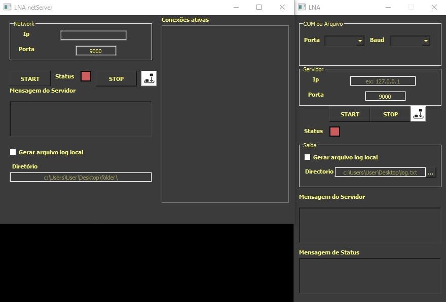

<h1 align="center">Server-client Communication at OPD</h1>
<h3 align="center">Simple Server-client for monitoring porpuses</h3>

Install the requirements >> pip install -r requirements.txt

### Images

